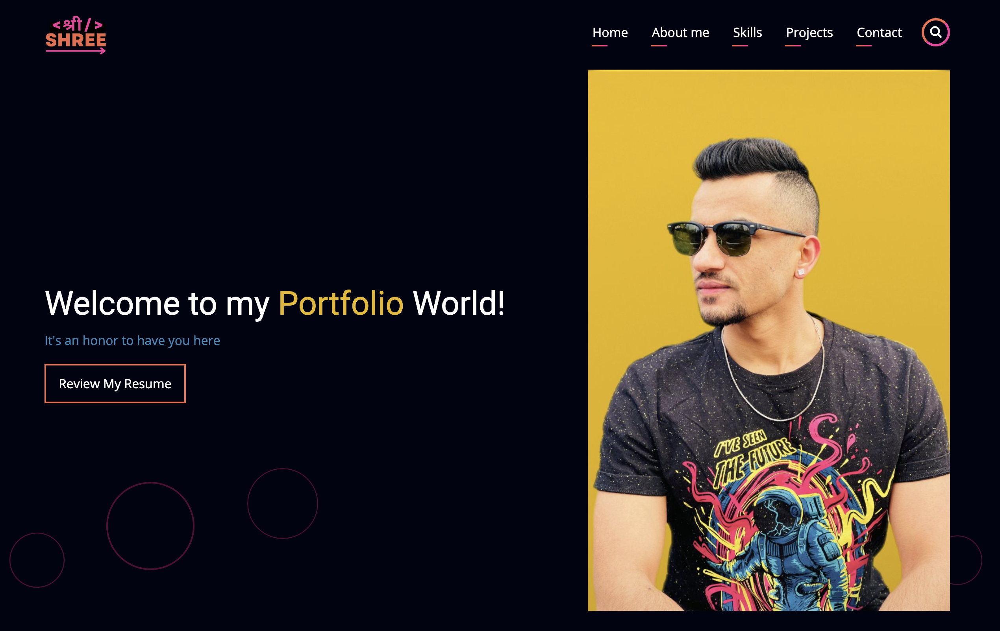
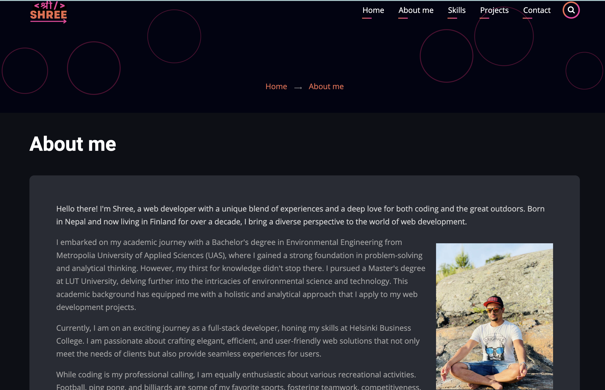
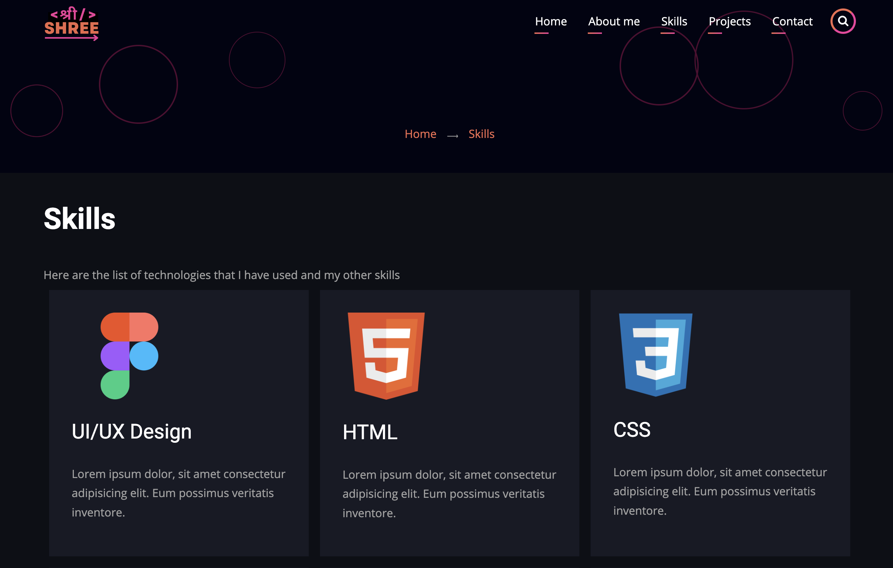
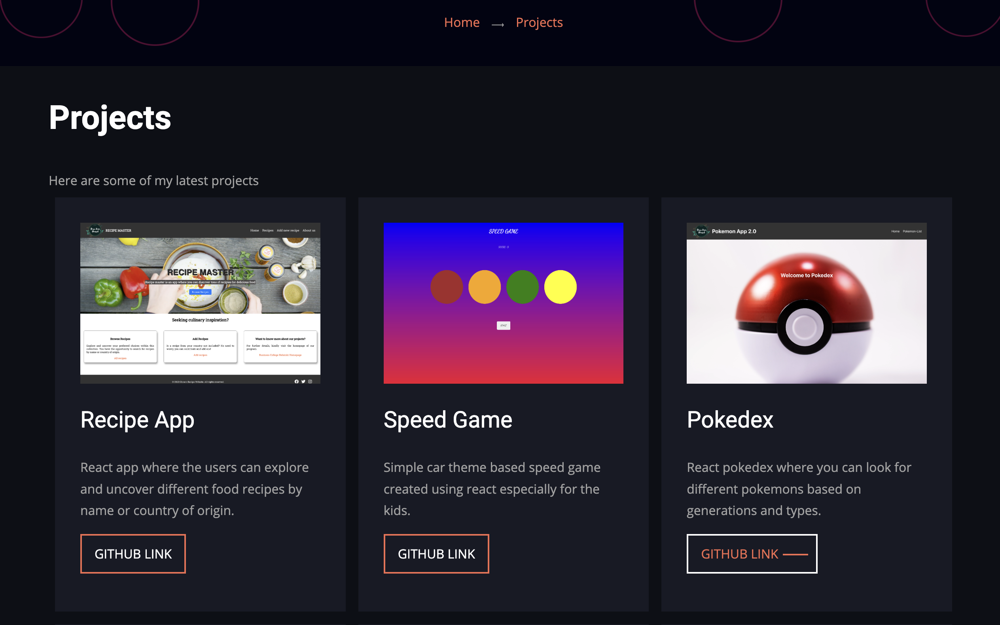
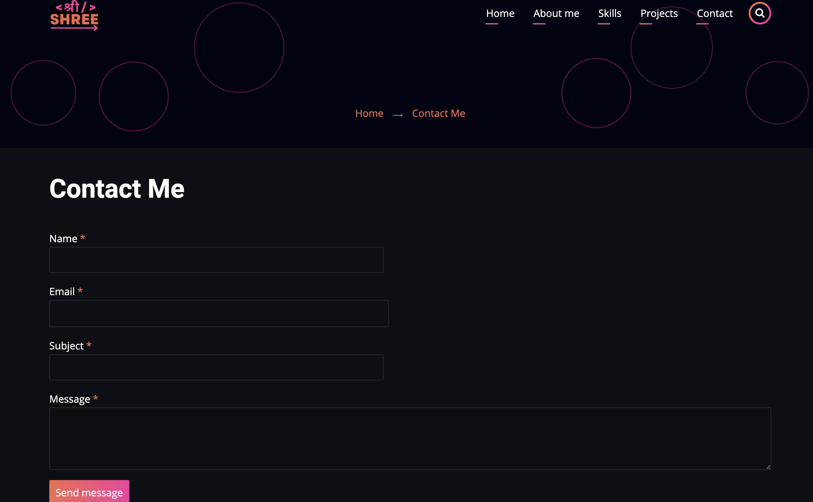

# Portfolio Project Drupal
- This is a portfolio project for the Drupal course. It contains homepage and four other pages: About me, Skills, Projects, and Contact. Anyone visiting my portfolio can easily contact me using the contact form available. 

### Contributed Theme used
- Zuvi

### Contributed Modules Used
- Pathauto
- Token
- contact_storage

### Live at:
- https://live-shree-portfolio.pantheonsite.io/

### Screenshots:

